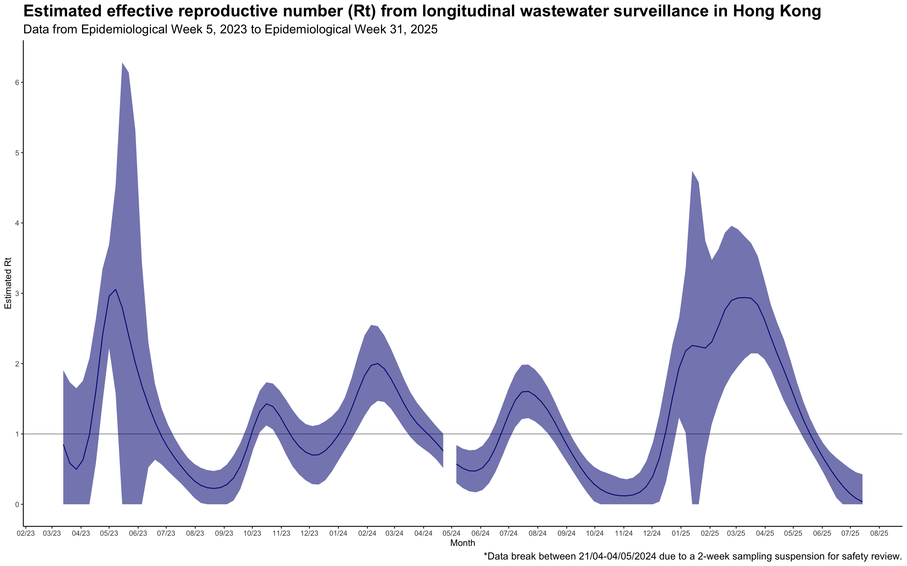

# Wastewater Epidemiology & Reproductive Numbers
Right before MPhil started I did an internship at the HK Department of Health. It was my first ever internship, and it was related to my then future (i.e. current) field of study, so I was really excited about it. Into an unknown abyss for me I was shipped into the Wastewater Surveillance section within the Centre for Health Protection. This following mini-project I did wasn't exactly planned, but wrapped up my rather interesting time there. Here I decided to make public of my work because why not, it's based on publicly available data anyway, and DH doesn't have a dashboard for visualization so here goes.

Obviously I am super new to Wastewater Epidemiology and actually I wasn't working on wastewater previously (my interest are in bones), or now (but I do touch on various stuff outside of bones when my PI told me to), so the code probably is not the most systemic or rigorous in terms of findings. Although during my time there we were successful in observing the peaks actually corresponds approximately with the time new variants appeared, which is great because there might be alternative feasible ways to make predictions! And because I feel like this should be more widely used for surveillance, here's the code if anyone else on Earth or in the universe wants to take a quick look.

In any case, these are some Rt estimates drawn from summary data of wastewater viral loads and stuff, and I'm hoping that maybe someday it can be more widely used and become more interactive as time goes by (although I do suck at coding outside of R).

Here's the graph I drew: 

As the error ribbon suggests the 95% CI is quite large, so probably at times this can be inaccurate. Rt = Re btw. This is also not updated (yet) because time flies and it's alreaady December in all of a sudden.

For analysis I used EstimateR (https://github.com/covid-19-Re/estimateR/tree/master), and plotting with ggplot2 (https://ggplot2.tidyverse.org/). Codes based on those from the dashboard by WISE Switzerland (https://wise.ethz.ch/?page=overview).

## Reference
Package:
Scire J, Huisman JS, Grosu A, et al. estimateR: an R package to estimate and monitor the effective reproductive number. BMC Bioinformatics. 2023;24:310. https://doi.org/10.1186/s12859-023-05428-4

Parameters: (will format later bc no time to be cAreFuL yet)
Benefield et al. SARS-CoV-2 viral load peaks prior to symptom onset: a systematic review and individual-pooled analysis of coronavirus viral load from 66 studies. medRxiv (2020). https://doi.org/10.1101/2020.09.28.20202028
Nadeau et al. Influenza transmission dynamics quantified from wastewater. Swiss Med Wkly. 2024;154(1):3503. https://doi.org/10.57187/s.3503
Nishiura et al. Serial interval of novel coronavirus (COVID-19) infections. International Journal of Infectious Diseases 93, (2020): 284-286. https://doi.org/10.1016/j.ijid.2020.02.060

